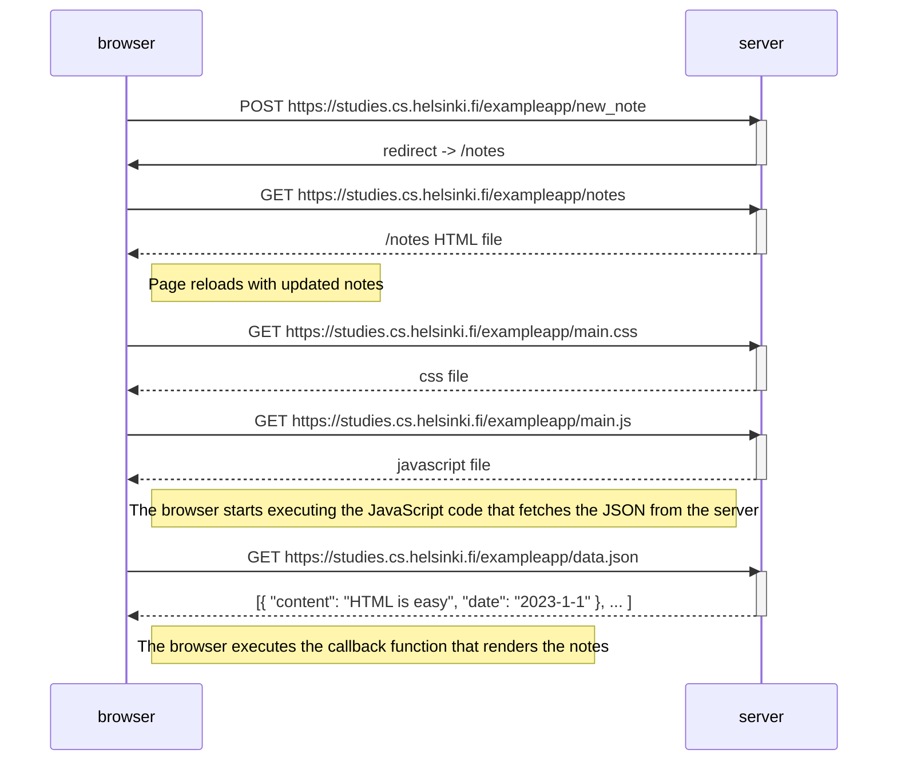

```mermaid
sequenceDiagram
  participant browser
  participant server

  # when button clicked, send user input to server
  # form submit event

    browser->>server: POST https://studies.cs.helsinki.fi/exampleapp/new_note

    activate server
    server->>browser: redirect -> /notes
    deactivate server

  # browser reloads Notes page

    browser->>server: GET https://studies.cs.helsinki.fi/exampleapp/notes

    activate server
    server-->>browser: /notes HTML file
    deactivate server

    Note right of browser: Page reloads with updated notes

  # fetch the style sheet (main.css)

    browser->>server: GET https://studies.cs.helsinki.fi/exampleapp/main.css

    activate server
    server-->>browser: css file
    deactivate server

  # fetch the javascript code (main.js)

    browser->>server: GET https://studies.cs.helsinki.fi/exampleapp/main.js

    activate server
    server-->>browser: javascript file
    deactivate server

    Note right of browser: The browser starts executing the JavaScript code that fetches the JSON from the server

  # fetch raw data of notes (data.json)

    browser->>server: GET https://studies.cs.helsinki.fi/exampleapp/data.json

    activate server
    server-->>browser: [{ "content": "HTML is easy", "date": "2023-1-1" }, ... ]
    deactivate server

    Note right of browser: The browser executes the callback function that renders the notes


```
