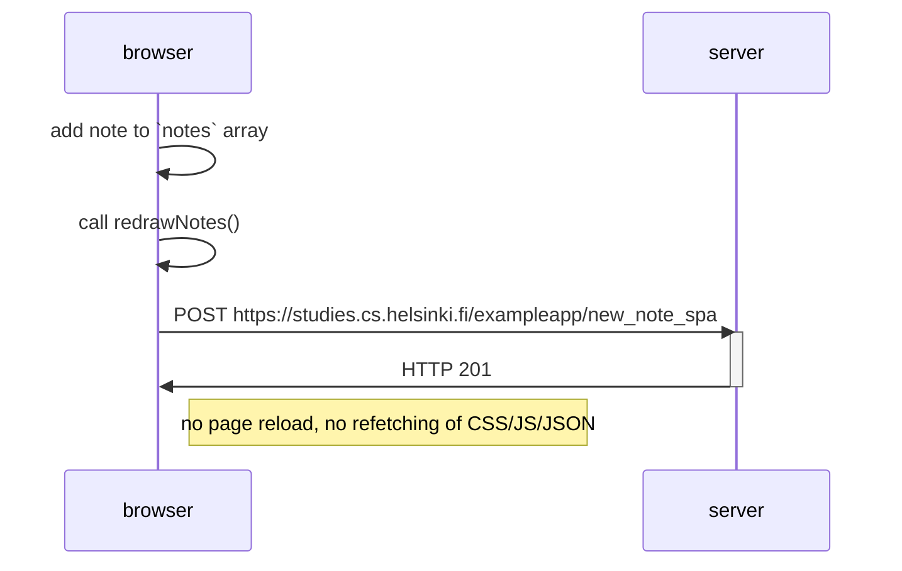

```mermaid
sequenceDiagram
  participant browser
  participant server

  # user submits form (no reload)
  # browser updates local cache and redraws

    browser->>browser: add note to `notes` array
    browser->>browser: call redrawNotes()

  # new note sent to server

    browser->>server: POST https://studies.cs.helsinki.fi/exampleapp/new_note_spa

    activate server
    server->>browser: HTTP 201
    deactivate server

    Note right of browser: no page reload, no refetching of CSS/JS/JSON


```
